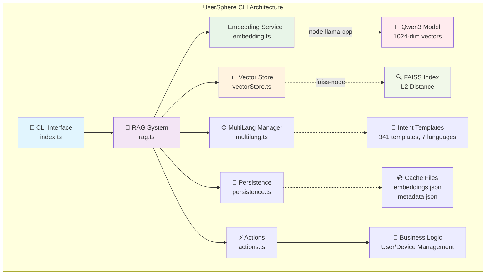
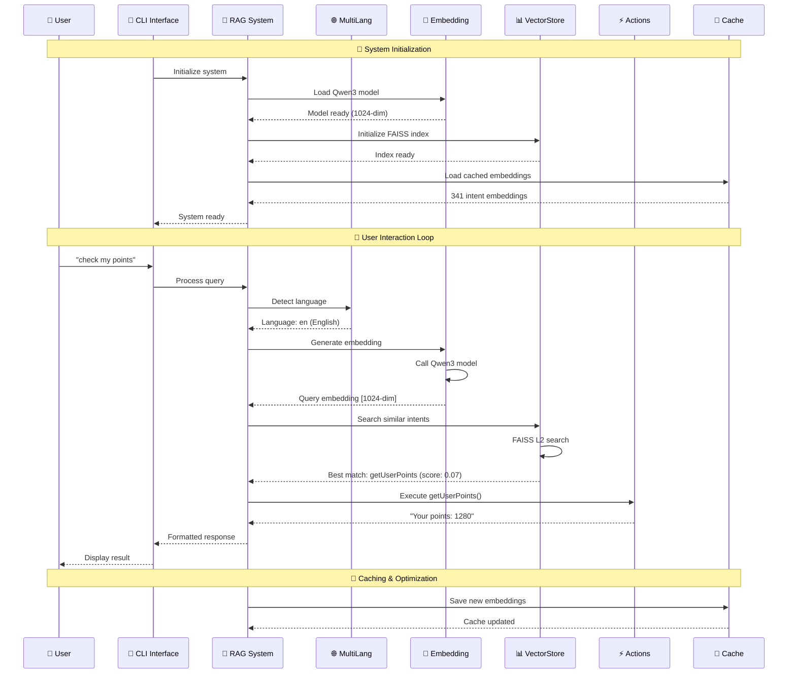
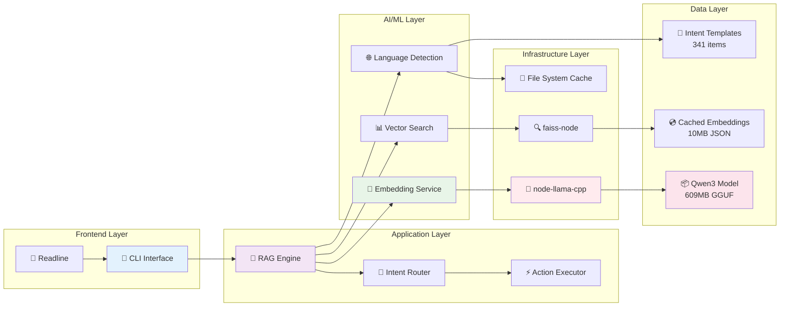
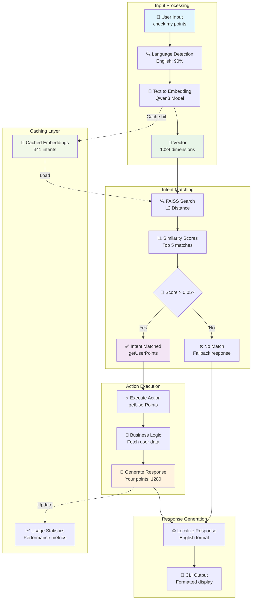
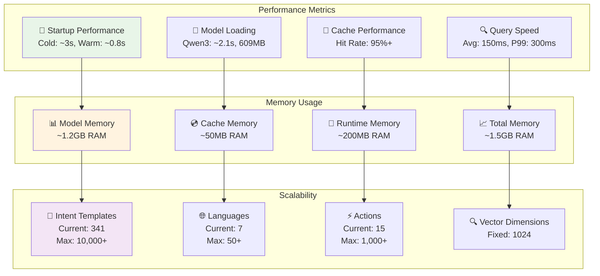
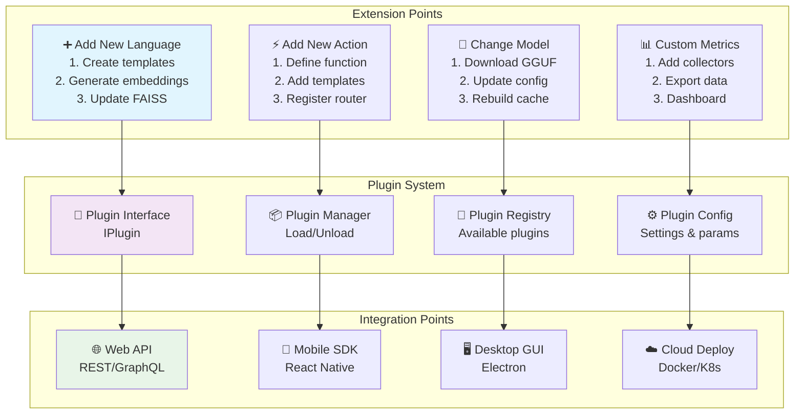

# UserSphere CLI

🚀 **Intelligent User and Device Management Command Line Tool**

[中文文档](README.md) | **English Documentation**

UserSphere CLI is an intelligent command-line tool based on RAG (Retrieval-Augmented Generation) technology, using local embedding models for semantic intent matching and supporting natural language interaction for user and device management functions.

## ✨ Features

- 🧠 **Intelligent Semantic Understanding**: Natural language processing based on local embedding models
- 🔍 **Efficient Vector Retrieval**: Fast similarity search using FAISS
- 🌐 **Multi-language Support**: Support for Chinese, English and other languages
- 💾 **Persistent Storage**: Automatic caching of embedding results for faster startup
- 🎯 **Intent Matching**: Precise user intent recognition and action execution
- 🛠️ **Modular Design**: Following Google TypeScript Style Guide
- 🔧 **Extensible Architecture**: Support for dynamic addition of new features and language templates

## 🏗️ System Architecture

### 📋 Project Module Structure Diagram



### 🔄 System Workflow Diagram



### 🏛️ Core Module Details

```
src/
├── 📱 index.ts              # CLI entry point
│   ├── Command line parsing
│   ├── User interaction interface
│   └── Main program loop
│
├── 🎯 rag.ts               # RAG core system
│   ├── System initialization coordination
│   ├── Query processing flow
│   ├── Intent matching logic
│   └── Response generation
│
├── 🧠 embedding.ts         # Embedding service
│   ├── Qwen3 model loading (node-llama-cpp)
│   ├── Text vectorization (1024-dim)
│   ├── Batch processing optimization
│   └── Resource management
│
├── 📊 vectorStore.ts       # Vector storage
│   ├── FAISS index management (faiss-node)
│   ├── L2 distance calculation
│   ├── Similarity search
│   └── Batch vector operations
│
├── ⚡ actions.ts           # Business logic
│   ├── User management functions
│   ├── Device management functions
│   ├── System functions
│   └── Dynamic parameter handling
│
├── 🌐 multilang.ts        # Multi-language management
│   ├── Language detection
│   ├── Intent template management (341 templates)
│   ├── 7 language support
│   └── Dynamic template extension
│
└── 💾 persistence.ts      # Persistent storage
    ├── Embedding cache
    ├── Metadata management
    ├── Cache validation
    └── Incremental updates
```

### 🛠️ Technology Stack Architecture



### 📊 Data Flow Architecture



### ⚡ Performance Metrics Architecture



### 🔧 Extension Architecture



## 📦 Installation

### Prerequisites

- Node.js >= 18.0.0
- Memory >= 4GB (for loading embedding models)
- Supported OS: macOS, Linux, Windows

### 1. Clone Repository

```bash
# SSH method (recommended)
git clone git@github.com:HeiSir2014/UserSphere.git
cd UserSphere

# Or use HTTPS method
git clone https://github.com/HeiSir2014/UserSphere.git
cd UserSphere
```

### 2. Install Dependencies

```bash
npm install
```

### 3. Download Embedding Models

Create `models` folder in project root and download models:

```bash
mkdir models
cd models

# Option 1: Qwen3 Embedding Model (Recommended, 1024-dim)
# Source: https://huggingface.co/Qwen/Qwen3-Embedding-0.6B-GGUF/
wget https://huggingface.co/Qwen/Qwen3-Embedding-0.6B-GGUF/resolve/main/Qwen3-Embedding-0.6B-Q8_0.gguf
# Or use curl
curl -L -O https://huggingface.co/Qwen/Qwen3-Embedding-0.6B-GGUF/resolve/main/Qwen3-Embedding-0.6B-Q8_0.gguf

# Option 2: EmbeddingGemma Model (Alternative, 768-dim)
# Source: https://huggingface.co/unsloth/embeddinggemma-300m-GGUF/
wget https://huggingface.co/unsloth/embeddinggemma-300m-GGUF/resolve/main/embeddinggemma-300M-Q8_0.gguf
# Or use curl
curl -L -O https://huggingface.co/unsloth/embeddinggemma-300m-GGUF/resolve/main/embeddinggemma-300M-Q8_0.gguf
```

### 4. Build Project

```bash
npm run build
```

### 5. Start Application

```bash
npm start
# or
./dist/index.js
```

## 🚀 Usage

### Basic Commands

```bash
# Start CLI
usersphere

# Specify model file
usersphere --model ./models/qwen3-embedding-0.6b.gguf

# Enable performance statistics
usersphere --timings

# Disable colored output
usersphere --no-color

# Show help
usersphere --help
```

### Interactive Examples

```bash
> check my points
🤖 Your points: 1280

> what devices do I have?
🤖 Current bound devices (4):
  • MacBook-Pro (laptop) - online
  • iPhone-15 (mobile) - online
  • iPad-Air (tablet) - offline
  • iMac-2021 (desktop) - online

> is iPhone online?
🤖 Device status:
  • iPhone-15 (mobile) - online - IP: 192.168.1.101

> add device Samsung-Galaxy
🤖 Device "Samsung-Galaxy" has been successfully added (status: online).

> help
🤖 UserSphere CLI available functions:
...
```

## 🌐 Multi-language Support

UserSphere CLI supports multi-language interaction, the system automatically recognizes language and matches corresponding functions:

### Chinese Examples
```bash
> 查询积分
> 我的用户名是什么
> 列出所有设备
> iPhone状态如何
```

### English Examples
```bash
> check my points
> what's my username
> list all devices
> iPhone status
```

### Supported Function Categories

| Function Category | Chinese Example | English Example |
|---------|---------|-----------------|
| User Info | 查询积分、用户名、头像 | check points, username, avatar |
| Device Management | 列出设备、设备状态、添加设备 | list devices, device status, add device |
| System Functions | 帮助、系统信息、退出 | help, system info, exit |

## 🛠️ Development

### Project Structure

```
src/
├── embedding.ts     # Embedding service wrapper
├── vectorStore.ts   # Vector storage and retrieval
├── rag.ts          # RAG logic and intent matching
├── actions.ts      # Business logic action implementation
├── multilang.ts    # Multi-language support module
├── persistence.ts  # Persistent storage module
└── index.ts        # CLI entry point

data/               # Data storage directory
├── embeddings.json # Cached embedding data
├── intents.json    # Intent template configuration
└── faiss.index     # FAISS index file
```

### Development Commands

```bash
# Run in development mode
npm run dev

# Build project
npm run build

# Code linting
npm run lint

# Fix code style
npm run lint:fix

# Clean build files
npm run clean
```

### Adding New Features

1. **Add new action** (in `actions.ts`):
```typescript
export function newAction(param: string): string {
  return `Execute new feature: ${param}`;
}
```

2. **Add intent template** (in `rag.ts`):
```typescript
{
  text: 'new feature',
  action: 'newAction',
  description: 'Execute new feature',
  category: 'custom',
  examples: ['new feature', 'run new feature'],
}
```

3. **Rebuild and test**:
```bash
npm run build
npm start
```

## 🔧 Configuration

### Environment Variables

```bash
# Model file path
USERSPHERE_MODEL_PATH=./models/qwen3-embedding-0.6b.gguf

# Data storage directory
USERSPHERE_DATA_DIR=./data

# Similarity threshold (0.0-1.0)
USERSPHERE_SIMILARITY_THRESHOLD=0.3

# Enable debug mode
USERSPHERE_DEBUG=true
```

### Model Configuration

Supported embedding models:

| Model | Dimensions | Size | Recommended Use |
|------|------|------|----------|
| qwen3-embedding:0.6b | 1024 | ~600MB | General recommendation |
| embeddinggemma | 768 | ~1.2GB | High precision scenarios |

## 📊 Performance Optimization

### First Startup Optimization

1. **Embedding Cache**: Calculate and cache all intent embeddings on first run
2. **FAISS Index**: Save FAISS index to local file
3. **Fast Loading**: Subsequent startups directly load cached data

### Memory Optimization

- Model loading: ~600MB - 1.2GB
- FAISS index: ~10MB
- Runtime memory: ~200MB

## 🐛 Troubleshooting

### Common Issues

**Q: Model loading failed**
```bash
❌ Model file does not exist or is corrupted
💡 Solution: Re-download model file, ensure file integrity
```

**Q: Out of memory**
```bash
❌ Memory overflow when loading model
💡 Solution: Ensure system has sufficient memory (recommended 4GB+)
```

**Q: Intent recognition inaccurate**
```bash
❌ System cannot understand user input
💡 Solution: Adjust similarity threshold or add more intent templates
```

### Debug Mode

Enable verbose logging:
```bash
USERSPHERE_DEBUG=true npm start
```

## 🤝 Contributing

1. Fork the project
2. Create feature branch: `git checkout -b feature/amazing-feature`
3. Commit changes: `git commit -m 'Add amazing feature'`
4. Push branch: `git push origin feature/amazing-feature`
5. Submit Pull Request

### Code Style

The project follows [Google TypeScript Style Guide](https://google.github.io/styleguide/tsguide.html):

- Use TypeScript strict mode
- Prefer `const` and `readonly`
- Complete type annotations
- Detailed JSDoc comments

## 📄 License

MIT License - see [LICENSE](LICENSE) file for details

## 🙏 Acknowledgments

- [node-llama-cpp](https://github.com/withcatai/node-llama-cpp) - Local LLM inference
- [faiss-node](https://github.com/ewfian/faiss-node) - Efficient vector retrieval
- [Qwen](https://github.com/QwenLM/Qwen) - Embedding models
- [Google Gemma](https://github.com/google/gemma) - Embedding models

## 📞 Support

- 📧 Email: heisir21@163.com
- 🐛 Issues: [GitHub Issues](https://github.com/HeiSir2014/UserSphere/issues)
- 💬 Discussions: [GitHub Discussions](https://github.com/HeiSir2014/UserSphere/discussions)

---

<div align="center">

**Made with ❤️ by HeiSir2014**

[⭐ Star](https://github.com/HeiSir2014/UserSphere) | [🍴 Fork](https://github.com/HeiSir2014/UserSphere/fork) | [📝 Report Bug](https://github.com/HeiSir2014/UserSphere/issues)

</div>
