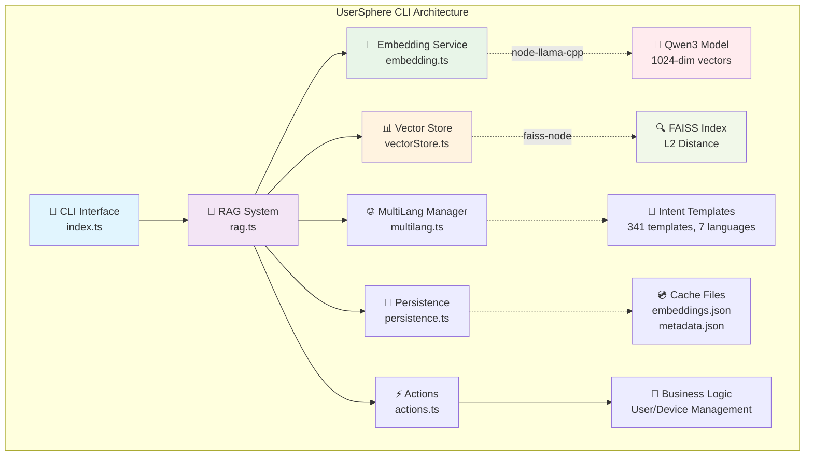
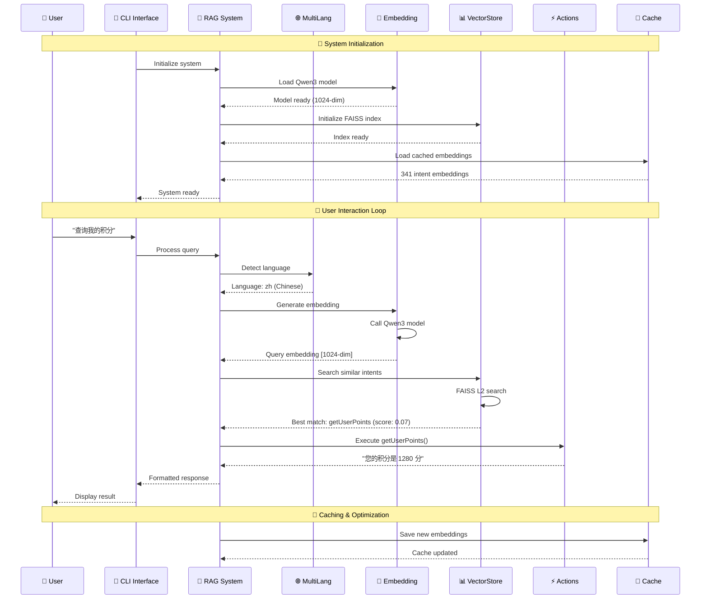
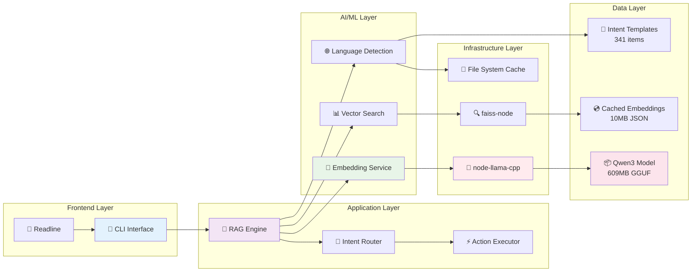
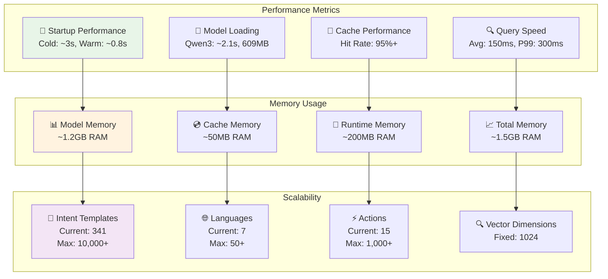
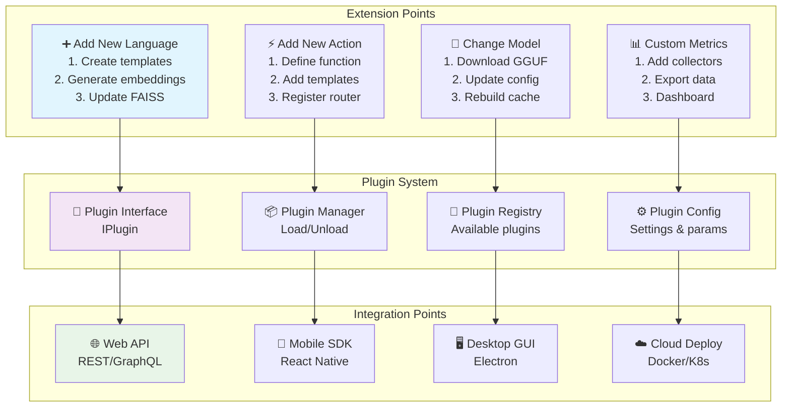

# UserSphere CLI

🚀 **智能用户和设备管理命令行工具**

UserSphere CLI 是一个基于 RAG (Retrieval-Augmented Generation) 技术的智能命令行工具，使用本地 embedding 模型进行语义意图匹配，支持自然语言交互的用户和设备管理功能。

## ✨ 特性

- 🧠 **智能语义理解**: 基于本地 embedding 模型的自然语言处理
- 🔍 **高效向量检索**: 使用 FAISS 进行快速相似度搜索
- 🌐 **多语言支持**: 支持中文、英文等多语言交互
- 💾 **持久化存储**: 自动缓存 embedding 结果，提升启动速度
- 🎯 **意图匹配**: 精确的用户意图识别和动作执行
- 🛠️ **模块化设计**: 遵循 Google TypeScript Style Guide
- 🔧 **可扩展架构**: 支持动态添加新功能和语言模板

## 🏗️ 系统架构

### 📋 项目模块结构图



### 🔄 系统工作流程图



### 🏛️ 核心模块详解

```
src/
├── 📱 index.ts              # CLI 入口点
│   ├── 命令行参数解析
│   ├── 用户交互界面
│   └── 主程序循环
│
├── 🎯 rag.ts               # RAG 核心系统
│   ├── 系统初始化协调
│   ├── 查询处理流程
│   ├── 意图匹配逻辑
│   └── 响应生成
│
├── 🧠 embedding.ts         # Embedding 服务
│   ├── Qwen3 模型加载 (node-llama-cpp)
│   ├── 文本向量化 (1024维)
│   ├── 批量处理优化
│   └── 资源管理
│
├── 📊 vectorStore.ts       # 向量存储
│   ├── FAISS 索引管理 (faiss-node)
│   ├── L2 距离计算
│   ├── 相似度搜索
│   └── 批量向量操作
│
├── ⚡ actions.ts           # 业务逻辑
│   ├── 用户管理功能
│   ├── 设备管理功能
│   ├── 系统功能
│   └── 动态参数处理
│
├── 🌐 multilang.ts        # 多语言管理
│   ├── 语言检测
│   ├── 意图模板管理 (341个)
│   ├── 7种语言支持
│   └── 动态模板扩展
│
└── 💾 persistence.ts      # 持久化存储
    ├── Embedding 缓存
    ├── 元数据管理
    ├── 缓存验证
    └── 增量更新
```

### 🛠️ 技术栈架构图



### 📊 数据流架构图

```mermaid
flowchart TD
    subgraph "Input Processing"
        A[👤 User Input<br/>"查询我的积分"] --> B[🔍 Language Detection<br/>Chinese: 50%]
        B --> C[🧠 Text → Embedding<br/>Qwen3 Model]
        C --> D[📐 Vector<br/>[1024 dimensions]]
    end
    
    subgraph "Intent Matching"
        D --> E[🔍 FAISS Search<br/>L2 Distance]
        E --> F[📊 Similarity Scores<br/>Top 5 matches]
        F --> G{🎯 Score > 0.05?}
        G -->|Yes| H[✅ Intent Matched<br/>getUserPoints]
        G -->|No| I[❌ No Match<br/>Fallback response]
    end
    
    subgraph "Action Execution"
        H --> J[⚡ Execute Action<br/>getUserPoints()]
        J --> K[💼 Business Logic<br/>Fetch user data]
        K --> L[📝 Generate Response<br/>"您的积分是 1280 分"]
    end
    
    subgraph "Response Generation"
        L --> M[🌐 Localize Response<br/>Chinese format]
        I --> M
        M --> N[📱 CLI Output<br/>Formatted display]
    end
    
    subgraph "Caching Layer"
        C -.->|Cache hit| O[💾 Cached Embeddings<br/>341 intents]
        O -.->|Load| E
        L -.->|Update| P[📈 Usage Statistics<br/>Performance metrics]
    end
    
    style A fill:#e1f5fe
    style D fill:#e8f5e8
    style H fill:#f3e5f5
    style L fill:#fff3e0
    style O fill:#f1f8e9
```

### ⚡ 性能指标架构图



### 🔧 扩展架构图



## 📦 安装

### 前置要求

- Node.js >= 18.0.0
- 内存 >= 4GB (用于加载 embedding 模型)
- 支持的操作系统: macOS, Linux, Windows

### 1. 克隆项目

```bash
git clone <repository-url>
cd UserSphereCLI
```

### 2. 安装依赖

```bash
npm install
```

### 3. 下载 Embedding 模型

在项目根目录创建 `models` 文件夹并下载模型：

```bash
mkdir models
cd models

# 下载推荐的 embedding 模型 (选择其一)
# qwen3-embedding:0.6b (推荐，384维) [https://huggingface.co/Qwen/Qwen3-Embedding-0.6B-GGUF/](https://huggingface.co/Qwen/Qwen3-Embedding-0.6B-GGUF/)
wget https://huggingface.co/Qwen/Qwen3-Embedding-0.6B-GGUF/resolve/main/Qwen3-Embedding-0.6B-Q8_0.gguf
or
curl -L -O https://huggingface.co/Qwen/Qwen3-Embedding-0.6B-GGUF/resolve/main/Qwen3-Embedding-0.6B-Q8_0.gguf

# 或 embeddinggemma [https://huggingface.co/unsloth/embeddinggemma-300m-GGUF/](https://huggingface.co/unsloth/embeddinggemma-300m-GGUF/)
wget https://huggingface.co/unsloth/embeddinggemma-300m-GGUF/resolve/main/embeddinggemma-300M-Q8_0.gguf
curl -L -O https://huggingface.co/unsloth/embeddinggemma-300m-GGUF/resolve/main/embeddinggemma-300M-Q8_0.gguf
```

### 4. 构建项目

```bash
npm run build
```

### 5. 启动应用

```bash
npm start
# 或
./dist/index.js
```

## 🚀 使用方法

### 基本命令

```bash
# 启动 CLI
usersphere

# 指定模型文件
usersphere --model ./models/qwen3-embedding-0.6b.gguf

# 启用性能统计
usersphere --timings

# 禁用彩色输出
usersphere --no-color

# 查看帮助
usersphere --help
```

### 交互示例

```bash
> 查询我的积分
🤖 您的积分是 1280 分

> 我有哪些设备？
🤖 当前绑定的设备 (4 个):
  • MacBook-Pro (laptop) - 在线
  • iPhone-15 (mobile) - 在线
  • iPad-Air (tablet) - 离线
  • iMac-2021 (desktop) - 在线

> iPhone 在线吗？
🤖 设备状态:
  • iPhone-15 (mobile) - 在线 - IP: 192.168.1.101

> 添加设备 Samsung-Galaxy
🤖 设备 "Samsung-Galaxy" 已成功添加 (状态: 在线)。

> help
🤖 UserSphere CLI 可用功能:
...
```

## 🌐 多语言支持

UserSphere CLI 支持多语言交互，系统会自动识别语言并匹配相应的功能：

### 中文示例
```bash
> 查询积分
> 我的用户名是什么
> 列出所有设备
> iPhone状态如何
```

### English Examples
```bash
> check my points
> what's my username
> list all devices
> iPhone status
```

### 支持的功能类别

| 功能类别 | 中文示例 | English Example |
|---------|---------|-----------------|
| 用户信息 | 查询积分、用户名、头像 | check points, username, avatar |
| 设备管理 | 列出设备、设备状态、添加设备 | list devices, device status, add device |
| 系统功能 | 帮助、系统信息、退出 | help, system info, exit |

## 🛠️ 开发

### 项目结构

```
src/
├── embedding.ts     # Embedding 服务封装
├── vectorStore.ts   # 向量存储和检索
├── rag.ts          # RAG 逻辑和意图匹配
├── actions.ts      # 业务逻辑动作实现
├── multilang.ts    # 多语言支持模块
├── persistence.ts  # 持久化存储模块
└── index.ts        # CLI 入口点

data/               # 数据存储目录
├── embeddings.json # 缓存的 embedding 数据
├── intents.json    # 意图模板配置
└── faiss.index     # FAISS 索引文件
```

### 开发命令

```bash
# 开发模式运行
npm run dev

# 构建项目
npm run build

# 代码检查
npm run lint

# 修复代码风格
npm run lint:fix

# 清理构建文件
npm run clean
```

### 添加新功能

1. **添加新动作** (在 `actions.ts`):
```typescript
export function newAction(param: string): string {
  return `执行新功能: ${param}`;
}
```

2. **添加意图模板** (在 `rag.ts`):
```typescript
{
  text: '新功能',
  action: 'newAction',
  description: '执行新功能',
  category: 'custom',
  examples: ['执行新功能', 'run new feature'],
}
```

3. **重新构建和测试**:
```bash
npm run build
npm start
```

## 🔧 配置

### 环境变量

```bash
# 模型文件路径
USERSPHERE_MODEL_PATH=./models/qwen3-embedding-0.6b.gguf

# 数据存储目录
USERSPHERE_DATA_DIR=./data

# 相似度阈值 (0.0-1.0)
USERSPHERE_SIMILARITY_THRESHOLD=0.3

# 启用调试模式
USERSPHERE_DEBUG=true
```

### 模型配置

支持的 embedding 模型：

| 模型 | 维度 | 大小 | 推荐用途 |
|------|------|------|----------|
| qwen3-embedding:0.6b | 384 | ~600MB | 通用推荐 |
| embeddinggemma | 768 | ~1.2GB | 高精度场景 |

## 📊 性能优化

### 首次启动优化

1. **Embedding 缓存**: 首次运行时计算并缓存所有意图的 embedding
2. **FAISS 索引**: 保存 FAISS 索引到本地文件
3. **快速加载**: 后续启动直接加载缓存数据

### 内存优化

- 模型加载: ~600MB - 1.2GB
- FAISS 索引: ~10MB
- 运行时内存: ~200MB

## 🐛 故障排除

### 常见问题

**Q: 模型加载失败**
```bash
❌ 模型文件不存在或损坏
💡 解决方案: 重新下载模型文件，确保文件完整性
```

**Q: 内存不足**
```bash
❌ 加载模型时内存溢出
💡 解决方案: 确保系统有足够内存 (推荐 4GB+)
```

**Q: 意图识别不准确**
```bash
❌ 系统无法理解用户输入
💡 解决方案: 调整相似度阈值或添加更多意图模板
```

### 调试模式

启用详细日志：
```bash
USERSPHERE_DEBUG=true npm start
```

## 🤝 贡献

1. Fork 项目
2. 创建功能分支: `git checkout -b feature/amazing-feature`
3. 提交更改: `git commit -m 'Add amazing feature'`
4. 推送分支: `git push origin feature/amazing-feature`
5. 提交 Pull Request

### 代码风格

项目遵循 [Google TypeScript Style Guide](https://google.github.io/styleguide/tsguide.html)：

- 使用 TypeScript strict 模式
- 优先使用 `const` 和 `readonly`
- 完整的类型注解
- 详细的 JSDoc 注释

## 📄 许可证

MIT License - 详见 [LICENSE](LICENSE) 文件

## 🙏 致谢

- [node-llama-cpp](https://github.com/withcatai/node-llama-cpp) - 本地 LLM 推理
- [faiss-node](https://github.com/ewfian/faiss-node) - 高效向量检索
- [Qwen](https://github.com/QwenLM/Qwen) - Embedding 模型
- [Google Gemma](https://github.com/google/gemma) - Embedding 模型

## 📞 支持

- 📧 Email: heisir2014@example.com
- 🐛 Issues: [GitHub Issues](https://github.com/heisir2014/UserSphereCLI/issues)
- 💬 Discussions: [GitHub Discussions](https://github.com/heisir2014/UserSphereCLI/discussions)

---

<div align="center">

**Made with ❤️ by HeiSir2014**

[⭐ Star](https://github.com/heisir2014/UserSphereCLI) | [🍴 Fork](https://github.com/heisir2014/UserSphereCLI/fork) | [📝 Report Bug](https://github.com/heisir2014/UserSphereCLI/issues)

</div>